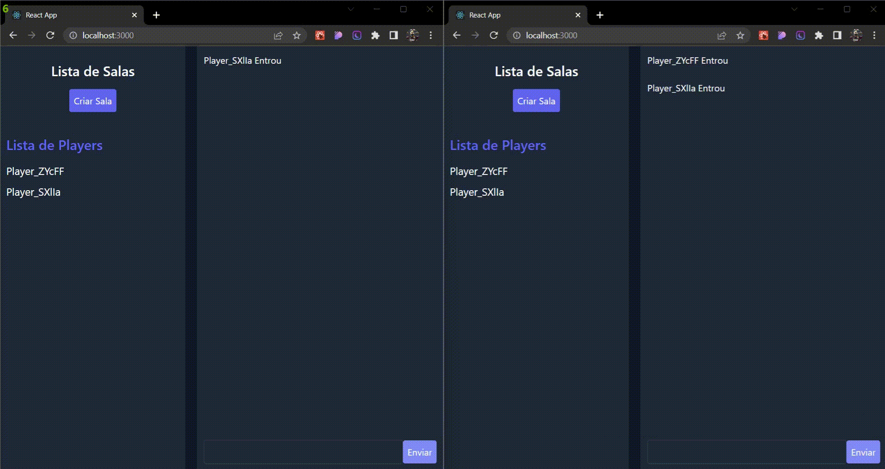
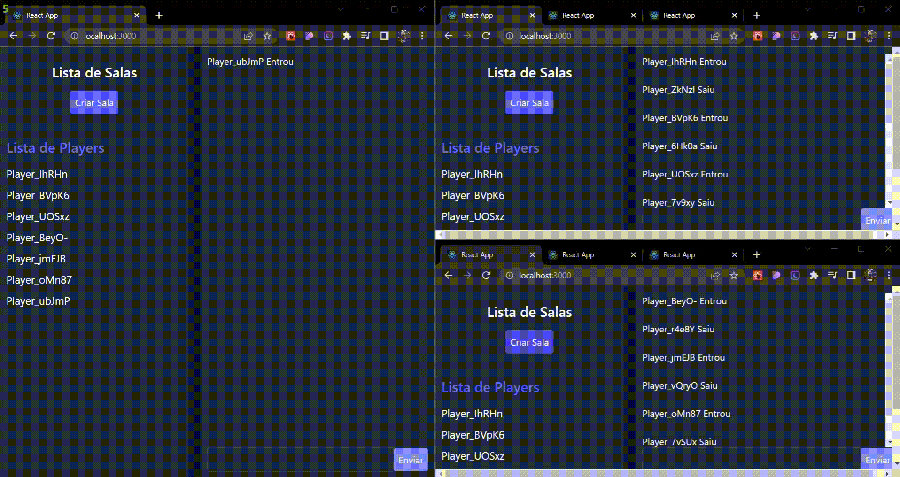

<h1 name='nome-do-projeto' align="center">Pong Multiplayer</h1>

<h4 align="center">
  <a href="#Projeto" >
    Projeto
  </a>
  |
  <a href="#Imagens" >
    Imagens
  </a>
  |
  <a href="#Tecnologias" >
    Tecnologias
  </a>
  |
  <a href="#Licença" >
    Licença
  </a>
</h4>

 
<h2 name="Projeto">📃 Projeto</h2>

Pong é um jogo multiplayer bidimensional que simula um tênis de mesa. O jogador controla uma paleta no jogo movendo-a verticalmente no lado esquerdo da tela, e compete contra outro jogador que controla uma segunda raquete no lado oposto. Os jogadores usam suas paletas para acertar a bola e mandá-la para o outro lado. Quando a bola passa pela paleta é computado ponto para o adversário. O jogo acaba quando um dos jogadores chegar a 10 pontos.

Optei por desenvolver esse projeto no intuito de melhorar minhas habilidades com React e Node, além da possibilidade de aprender uma tecnologia como o Socket io.

 
 
<h2 name="Imagens">🎴 Imagens</h2>

<h6>Chat em tempo real com todos os usu√°rios conectados</h6>

  

<h6>Sala com uma partida em andamento</h6>

  

<h6>Usu√°rios na tela inicial podem ver o placar de todas as partidas</h6>

  

 
 
<h2 name="Tecnologias">💻 Tecnologias</h2>

Esse projeto foi desenvolvido com as seguintes tecnologias:

🖌️ Front-End

- React
- Context API
- JavaScript
- HTML
- Tailwind CSS
- Socket io

⚙️ Back-End

- NodeJs
- Express
- Nodemon
- Socket io

 
 

<h2>Padr√£o de commit</h2>

| Emoji          | Tipo de Commit                        |
| -------------- | ------------------------------------- |
| :tada:         | first commit                          |
| :art:          | quando melhorar a estrutura do código |
| :memo:         | quando escrever alguma documentação   |
| :bug:          | quando corrigir um bug                |
| :fire:         | quando remover códigos ou arquivos    |
| :lock:         | quando melhorar a segurança           |
| :construction: | em construção                         |
| :rocket:       | nova feature                          |
| :see_no_evil:  | gambiarra                             |
| :gift:         | nova vers√£o                           |

<h5>Criado por: <a href='https://gist.github.com/crissilvaeng/dfb5b14f8eb2c25df4fd8a49f4f03252'>crissilvaeng</a></h5>

 
 
<h2 name="Licença">📝 Licença</h2>

Esse projeto está sob licença. Veja o arquivo [LICENSE](LICENSE) para mais detalhes.

 
 

[⬆ Voltar ao topo](#nome-do-projeto) 
